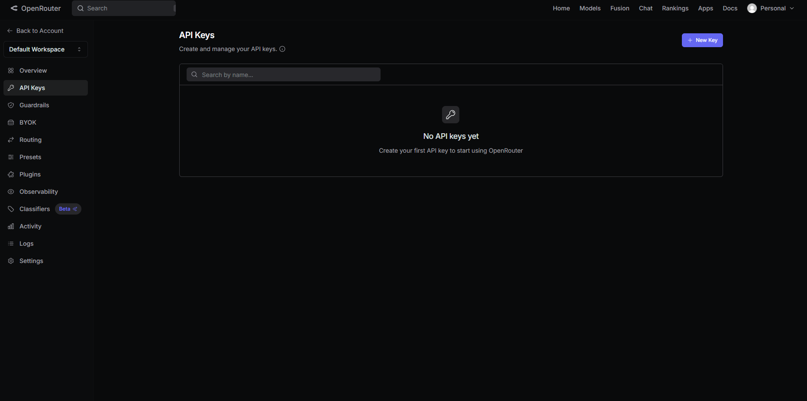

# 🤖 Ada — Virtual Assistant


**Ada** es una asistente virtual de escritorio desarrollada nativamente en **C++** utilizando **SDL2** para la interfaz gráfica y la API de **OpenRouter** para el motor de inteligencia artificial. Cuenta con un sistema de voz fluido en español nativo a través de la API SAPI de Windows y memoria persistente de conversación.

---

## 🚀 Características Principales

* **Motor de IA Avanzado:** Conexión de baja latencia con modelos a través de OpenRouter.
* **Memoria Persistente:** Historial de conversación guardado localmente en un buffer cíclico (`memories.json`).
* **Texto a Voz (TTS):** Integración directa con Windows SAPI configurado específicamente con la voz nativa de **Microsoft Sabina**.
* **Capacidad de controlar tu PC:** Ella puede tanto apagar tu PC, reiniciarla, abrir apps de tu equipo y hacerte recordatorios para hoy o mañana.
* **Gestos**: Ada cambia de gesto dependiendo del tema que hables con ella. Esto es con el objetivo de que la comunicación con ella sea más interactiva

---

## Requisito inicial para utlizar a la asistente 

Para poder utilizarla necesitas una API Key de [OpenRouter](https://www.openrouter.ai). Para obtenerla haz los siguentes pasos:

* Obtener API Key:
    * Registra/Inicia sesión en [OpenRouter](https://www.openrouter.ai)

    * Crea una API Key presionando "New Key" luego de iniciar sesión/registrarse

    

* Configuración inicial en la app

    * Guarda la API Key en un sitio seguro

    * Ingresa la API Key al momento de iniciar la app(por primera vez)

    * Diviertete con Ada ;)

---

## 🛠️ Requisitos de Desarrollo

Para compilar y correr este proyecto desde cero, necesitas las siguientes herramientas y dependencias:

### Dependencias en Linux (Ubuntu/Debian)
* **Compilador:** `g++` con soporte para C++17 o superior.
* **Librerías de Desarrollo:**
```bash
sudo apt install build-essential libsdl2-dev libsdl2-image-dev libsdl2-ttf-dev libcurl4-openssl-devdule update --init --recursive
```
* **Parser JSON: `nlohmann-json que ya está en ./include`**
* **Motor de voz: binario de Piper en:`./bin/piper`**

### Dependencias para Windows(MinGW/MSYS2)
* **Compilador:** `g++` con soporte para C++17 o superior(x86_64).
* **Librerías gráficas: SDL2, SDL2_image, SDL2_ttf**
* **Librería de red: `libcurl`**

Para iniciar los submodulos(en este caso md4c), ejecuta en la terminal:
 ```bash
 git submodule update --init --recursive
 ```

