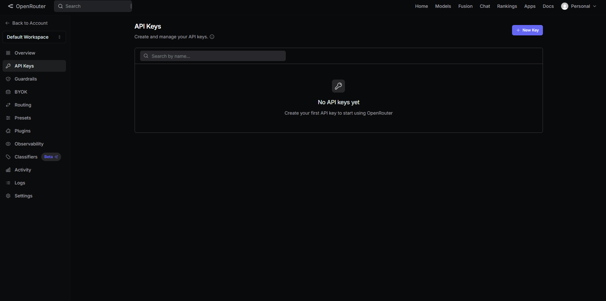

# 🤖 Ada — Virtual Assistant


**Ada** is a desktop virtual assistant natively developed in **C++** using **SDL2** for the graphical interface and the **OpenRouter** API for the artificial intelligence engine. It features a fluent Spanish voice system through the Windows SAPI API (PicoTTS is used on Linux) and persistent conversation memory.

---

## 🚀 Key Features

* **Advanced AI Engine:** Low-latency connection with models through OpenRouter.
* **Persistent Memory:** Conversation history stored locally in a circular buffer (`memories.json`).
* **Text-to-Speech (TTS):** Direct integration with Windows SAPI specifically configured with the native **Microsoft Sabina** voice (PicoTTS is used on Linux).
* **Speech-to-Text (STT):** The app uses **Vosk** to transcribe your voice to text, allowing you to give voice prompts and just press Enter to send. To use this feature, press Shift + F1 in the app.
* **PC Control Capabilities:** It can shut down your PC, restart it, open apps on your system, open websites, execute system commands, and set reminders for today or tomorrow.
* **Gestures:** Ada changes her gesture depending on the topic you're discussing with her. This aims to make communication with her more interactive.
* **Offline Mode:** The app features an offline mode powered by [Llama](https://github.com/ggml-org/llama.cpp/tree/6eddde06a4f25d55d538b5d15628dcc2b6882147). To use this mode, you need at least 8GB of RAM. 16GB of RAM is recommended if you want to use offline mode with many other apps open on your system.

---

## Initial requirements to use the assistant

To use it, you need an API Key from [OpenRouter](https://www.openrouter.ai). To obtain it, follow these steps:

* Get API Key:
    * Register/Sign in to [OpenRouter](https://www.openrouter.ai)

    * Create an API Key by pressing "New Key" after signing in/registering

    

* Initial setup in the app

    * Store the API Key in a safe place

    * Enter the API Key when launching the app (for the first time)
 
    * Choose an AI model in the app

    * Enjoy Ada ;)

---

## 🛠️ Development Requirements

To compile and run this project from scratch, you need the following tools and dependencies:

### Linux (Ubuntu/Debian) Dependencies
* **Compiler:** `g++` with C++17 support or higher.
* **NSIS (optional):** needed to compile the Windows installer (setup) via cross-compiling.
* **Development Libraries:**
```bash
sudo apt install build-essential cmake libsdl2-dev libsdl2-image-dev libsdl2-ttf-dev libsdl2-mixer-dev libttspico-dev libnotify-dev libcurl4-openssl-dev
```
* **JSON Parser:** `nlohmann-json` which is already in `./include`

### Windows (MinGW/MSYS2) Dependencies
* **Compiler:** `g++` with C++17 support or higher (x86_64).
* **Build Automation Tool:** `cmake` in its latest version (recommended).
* **NSIS (mandatory):** needed to compile the Windows installer (setup).
* **Graphics Libraries:** `SDL2, SDL2_image, SDL2_ttf`
* **Networking Library:** `libcurl`
* **JSON Parser:** `nlohmann-json` which is already in `./include`

To initialize the submodules (in this case md4c and llama.cpp), run in the terminal:
 ```bash
 git submodule update --init --recursive
 ```
---

If you installed Ada for Debian-based distros (via the .deb package), you can run it from the terminal with the command:
```bash
ada
```

# Build Instructions
If you want to compile Ada for your host OS, just use the `make` command. To compile for Windows from Linux, use `make CROSS=1`. To compile on Windows, just use the `make` command.
> **Note for cross-compiling for Windows:** If you are compiling Ada for Windows from Linux, I recommend download the custom MinGW-w64 toolchain [here](https://github.com/Silver148/Mingw-w64-Toolchain/releases). This package features the latest experimental GCC from the main branch, complete with POSIX threads and OpenMP support, which is highly recommended for building this project smoothly.

If you want to debug the app, compile it with the DEBUG=1 parameter, e.g.: `make DEBUG=1`, `make DEBUG=1 CROSS=1 all`

To clean the app compilation, use the `make clean_app` command. To clean everything including dependency compilation (md4c and llama.cpp), use the `make clean_all` command.

## Packaging Instructions
Use the `make make_debian_package` command to create the .deb package for Ada, and `make install_debian_package` to install the package on your system. On Linux, using `make` automatically creates the .tar.gz archive.

On Windows, use the `make pack_for_windows` command to create the .zip file for Windows.


